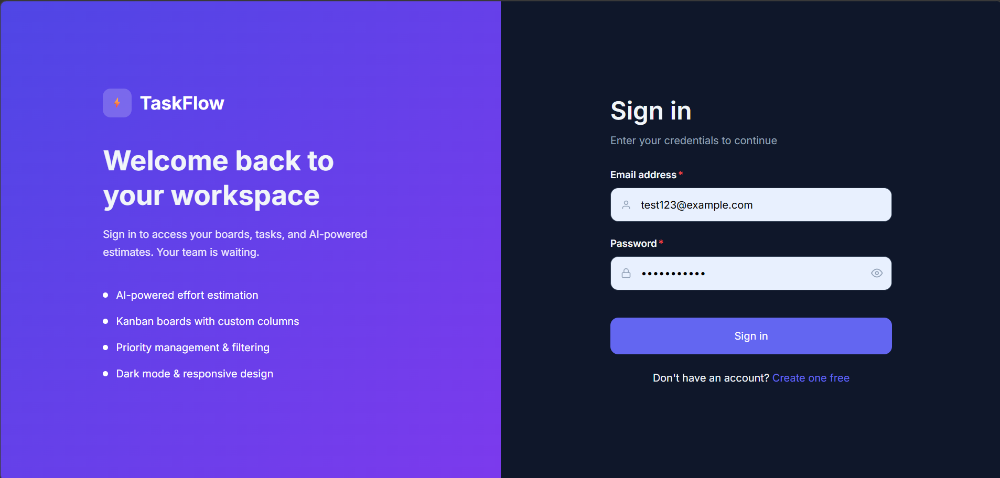
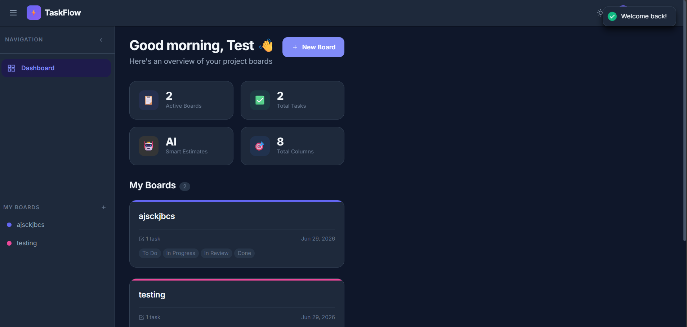

# 🚀 TaskFlow
### Smart Task & Project Manager

A modern full-stack task management application built with the **MERN Stack** that helps users organize projects using Kanban boards, manage tasks efficiently, and stay productive.

TaskFlow allows users to create multiple boards, manage tasks with priorities and due dates, track progress through different stages, and securely store everything in the cloud.

---

## 📸 Screenshots

> Add screenshots here after deployment.

| Login | Dashboard |
|--------|-----------|
|  |  |

---

# ✨ Features

## 🔐 Authentication

- User Registration
- Secure Login
- JWT Authentication
- Password Hashing using bcrypt
- Protected Routes
- Logout

---

## 📋 Boards

- Create Boards
- Rename Boards
- Delete Boards
- Dashboard displaying all boards
- User-specific boards

---

## ✅ Tasks

Each board contains tasks that can be managed easily.

Task Features

- Create Task
- Edit Task
- Delete Task
- Due Date
- Priority
    - Low
    - Medium
    - High
- Status
    - Todo
    - In Progress
    - Done
- Responsive task cards

---

## 🎨 User Experience

- Responsive Design
- Mobile Friendly
- Clean UI
- Loading States
- Error Handling
- Confirmation Dialogs
- Toast Notifications

---

# 🛠 Tech Stack

## Frontend

- React
- React Router
- Axios
- CSS
- Vite

---

## Backend

- Node.js
- Express.js

---

## Database

- MongoDB Atlas
- Mongoose

---

## Authentication

- JWT
- bcrypt

---

## Development Tools

- Git
- GitHub
- Thunder Client / Postman
- Nodemon

---

# 📂 Project Structure

```
TaskFlow
│
├── taskflow-client
│   ├── src
│   │   ├── components
│   │   ├── pages
│   │   ├── layouts
│   │   ├── hooks
│   │   ├── services
│   │   ├── styles
│   │   └── App.jsx
│   │
│   └── package.json
│
├── taskflow-server
│   ├── controllers
│   ├── middleware
│   ├── models
│   ├── routes
│   ├── validators
│   ├── utils
│   ├── config
│   ├── app.js
│   └── server.js
│
└── README.md
```

---

# ⚙️ Installation

## 1. Clone Repository

```bash
git clone https://github.com/yourusername/taskflow.git
```

```bash
cd taskflow
```

---

# 📦 Backend Setup

Move to backend

```bash
cd taskflow-server
```

Install packages

```bash
npm install
```

Create a `.env`

```env
PORT=5000

MONGO_URI=your_mongodb_connection_string

JWT_SECRET=your_secret_key

CLIENT_URL=http://localhost:5173
```

Run Backend

```bash
npm run dev
```

Backend starts on

```
http://localhost:5000
```

---

# 💻 Frontend Setup

Move to frontend

```bash
cd taskflow-client
```

Install packages

```bash
npm install
```

Create

```
.env
```

```env
VITE_API_URL=http://localhost:5000/api
```

Run

```bash
npm run dev
```

Frontend starts on

```
http://localhost:5173
```

---

# 🔑 Environment Variables

## Backend

```
PORT
MONGO_URI
JWT_SECRET
CLIENT_URL
```

## Frontend

```
VITE_API_URL
```

---

# 🔄 API Endpoints

## Authentication

| Method | Endpoint | Description |
|---------|----------|-------------|
| POST | /api/auth/register | Register User |
| POST | /api/auth/login | Login User |
| GET | /api/auth/me | Current User |
| PUT | /api/auth/profile | Update Profile |
| PUT | /api/auth/change-password | Change Password |

---

## Boards

| Method | Endpoint |
|---------|----------|
| GET | /api/boards |
| POST | /api/boards |
| PUT | /api/boards/:id |
| DELETE | /api/boards/:id |

---

## Tasks

| Method | Endpoint |
|---------|----------|
| GET | /api/boards/:boardId/tasks |
| POST | /api/boards/:boardId/tasks |
| PUT | /api/tasks/:id |
| DELETE | /api/tasks/:id |

---

# 🔒 Security

- Passwords are hashed using bcrypt.
- JWT Authentication.
- Protected API Routes.
- User-specific resource ownership.
- Environment variables for secrets.
- MongoDB Injection protection using Mongoose.

---

# 📱 Responsive Design

TaskFlow is designed to work across

- Desktop
- Laptop
- Tablet
- Mobile Devices

---

# 🚀 Deployment

Frontend

```
Vercel
```

Backend

```
Render
```

Database

```
MongoDB Atlas
```

---

# 🧪 Testing

The project APIs were tested using

- Thunder Client
- Postman

Authentication, Board and Task CRUD operations were verified successfully.

---

# 🎯 Future Improvements

- Drag & Drop Tasks
- AI Task Estimation
- Task Search
- Filters
- Calendar View
- Email Notifications
- Team Collaboration
- Activity Logs
- Dashboard Analytics
- Dark Mode

---

# 🤝 Contributing

Contributions are welcome.

1. Fork the repository

2. Create your branch

```bash
git checkout -b feature-name
```

3. Commit

```bash
git commit -m "Added feature"
```

4. Push

```bash
git push origin feature-name
```

5. Open a Pull Request

---

# 📄 License

This project is licensed under the MIT License.

---

# 👨‍💻 Author

**Garvit Bagda**

GitHub:
https://github.com/yourusername

LinkedIn:
https://linkedin.com/in/yourprofile

---

## ⭐ If you like this project, don't forget to give it a Star!
